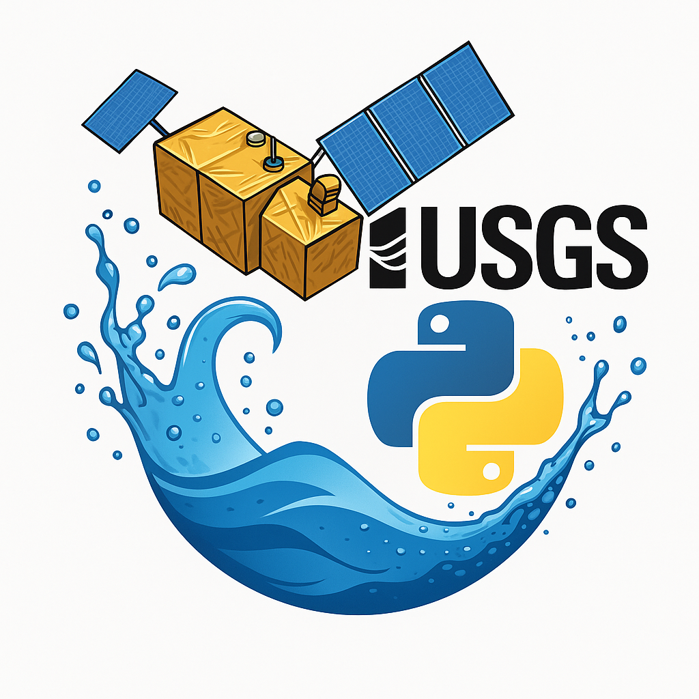

 
# HydroAnomaly

A Python package for water bodies anomaly detection. It retrieves **USGS water data** and **Sentinel-2 bands** to use in ML models for checking the quality of the data collected by USGS gages.

[](https://badge.fury.io/py/hydroanomaly)
[](https://pepy.tech/project/hydroanomaly)

## Installation
Python script:
```bash
pip install hydroanomaly
```
For Jupyter
```bash:
!pip install hydroanomaly
```
For updating the package:

```bash:
!pip install hydroanomaly --upgrade
```

---
## USGS Data Retrieval
Easily retrieve real-time and historical turbidity of water from USGS Water Services:

```python
import ee
import geemap
import hydroanomaly

# ------------------------
# User-defined settings: Example USGS site and date range (change to a site with turbidity data)
# ------------------------
site_number = "294643095035200"  # USGS site number
start_date = "2020-01-01"
end_date = "2024-12-30"

# ------------------------
# Data Extraction from USGS
# ------------------------
USGSdata, (lat, lon) = get_turbidity(site_number, start_date, end_date)
print("=" * 70)
print("Latitude:", lat)
print("Longitude:", lon)
print("=" * 70)
print(USGSdata.head())
```
---
## Sentinel-2 Data Retrieval
Retrieve Sentinel data from Google Earth Engine

### Defining the Google Earth Engine API
```python
ee.Authenticate()
ee.Initialize(project='XXXXXX-XXXX-XXXXXX-XX') # Replace with your own project ID number
```
### Defining settings, coordinates, masks, etc:

### Defining the area from which you want to retrieve data:
```python
latitude = 29.7785861
longitude = -95.0644278
bands = ['B2','B3','B4','B5','B6','B7','B8','B8A','B9','B11','B12', 'SCL']
buffer_meters = 20
cloudy_pixel_percentage = 20
masks_to_apply = [
    "water",
    "no_cloud_shadow",
    "no_clouds",
    "no_snow_ice",
    "no_saturated"
]
```

### Sentinel-2 data retrieval:
```python
from hydroanomaly import get_sentinel_bands

df = get_sentinel_bands(
    latitude=latitude,
    longitude=longitude,
    start_date=start_date,
    end_date=end_date,
    bands=bands,
    buffer_meters=buffer_meters,
    cloudy_pixel_percentage=cloudy_pixel_percentage,
    masks_to_apply=masks_to_apply
)

print(df.head())
print("=" * 70)
print(f"Retrieved {len(df)} rows")
```

### Visualizing the map:

```python
from hydroanomaly import show_sentinel_ndwi_map

Map = show_sentinel_ndwi_map(
    latitude, longitude, start_date, end_date,
    buffer_meters=buffer_meters, cloudy_pixel_percentage=cloudy_pixel_percentage, zoom=15)
Map
```
---
## Time Series Plotting
Create visualizations of your water data:

```python
from hydroanomaly.visualize import plot_timeseries
# For USGS data
plot_timeseries(USGSdata)
# For Sentinel data
plot_timeseries(df)
```

```python
from hydroanomaly.visualize import plot_turbidity
# For USGS data
plot_turbidity(USGSdata)
```

```python
from hydroanomaly.visualize import plot_sentinel
# For Sentinel data
plot_sentinel(df)
```

```python
from hydroanomaly.visualize import plot_comparison
plot_comparison(USGSdata, df[['B6']], label1="Turbidity", label2="Sentinel-2 B6", title="Comparison: Turbidity vs Band 6")
```

```python
from hydroanomaly import plot
# For Sentinel data
plot(df)
```

```python
from hydroanomaly import visualize
# For USGS data
visualize(USGSdata)
```

#### NDVI:
```python
import matplotlib.pyplot as plt
# Check available columns
print(df.columns)
print("=" * 70)
# Calculate NDVI if bands are available
if {'B4', 'B8'}.issubset(df.columns):
    df['NDVI'] = (df['B8'] - df['B4']) / (df['B8'] + df['B4'])
    df['NDVI'].plot(marker='o')
    plt.title("NDVI Time Series")
    plt.xlabel("Date")
    plt.ylabel("NDVI")
    plt.grid()
    plt.show()
else:
    print("NDVI bands (B4, B8) not found. Try plotting individual bands:")
    df[['B2', 'B3', 'B4', 'B8']].plot()
    plt.title("Sentinel-2 Reflectance (selected bands)")
    plt.ylabel("Reflectance")
    plt.xlabel("Date")
    plt.grid()
    plt.show()
```

---
## Machine Learning for Anomaly Detection of USGS Data

```python
print(df.columns)
print("=" * 70)
display(df.head(2))
print("=" * 70)
print(USGSdata.columns)
print("=" * 70)
display(USGSdata.head(2))
```

```python
USGSdata = USGSdata[~USGSdata.index.duplicated(keep='first')]
print(df.index.duplicated().sum())                     # Number of duplicate datetimes in df
print(USGSdata.index.duplicated().sum())               # Number of duplicate datetimes in USGSdata
```

### OneClassSVM

```python
from hydroanomaly.ml import run_oneclass_svm
df_out, params, f1 = run_oneclass_svm(df, USGSdata)
```

```python
# F1 Score
print(f"F1: {f1:.3f}")
```

### Isolation Forest
```python
from hydroanomaly.ml import run_isolation_forest
df_out_if, params_if, f1_if = run_isolation_forest(df, USGSdata)
```

```python
print(f"F1: {f1_if:.3f}")
```
---
## Features
* **USGS & Sentinel-2 Data Retrieval**
  * Download real-time and historical water data from USGS Water Services (any site, any parameter)
  * Retrieve Sentinel-2 satellite bands using Google Earth Engine for any location and time range
  * Automatic data cleaning, validation, and alignment between ground (USGS) and satellite (Sentinel) data
  * Synthetic data generation fallback for testing
  * Convenient CSV export functionality

* **Time Series & Satellite Visualization**
  * Quick plotting for single or multiple water quality parameters
  * Multi-parameter and multi-site comparison plots
  * Satellite band and index visualization (NDVI, NDWI, etc.)
  * Statistical analysis plots (histograms, box plots, trendlines)
  * High-quality plot export (PNG, PDF, SVG) with auto legends and formatting

* **Machine Learning & Anomaly Detection**
  * Built-in anomaly detection using One-Class SVM and Isolation Forest models
  * Visual comparison of predicted vs. true anomalies in time series data
  * Feature engineering for satellite and in-situ sensor data
  * Easy integration with Pandas workflows

* **Powerful Data Analysis Tools**
  * Mathematical operations and filtering for hydrologic data
  * Statistical summaries, validation, and automated quality checks
  * Utilities for matching, joining, and synchronizing time series

* **Easy to Use**
  * Simple, Pythonic API for rapid data exploration and analysis
  * One-liner data retrieval and plotting functions
  * Comprehensive error handling
  * Well-documented with step-by-step examples and tutorials


Find USGS site numbers at: https://waterdata.usgs.gov/nwis

---
## Contributing
Contributions are welcome! Please feel free to submit a Pull Request.

## License
This project is licensed under the MIT License - see the LICENSE file for details.

---

**HydroAnomaly** - Making water data analysis simple and beautiful!
